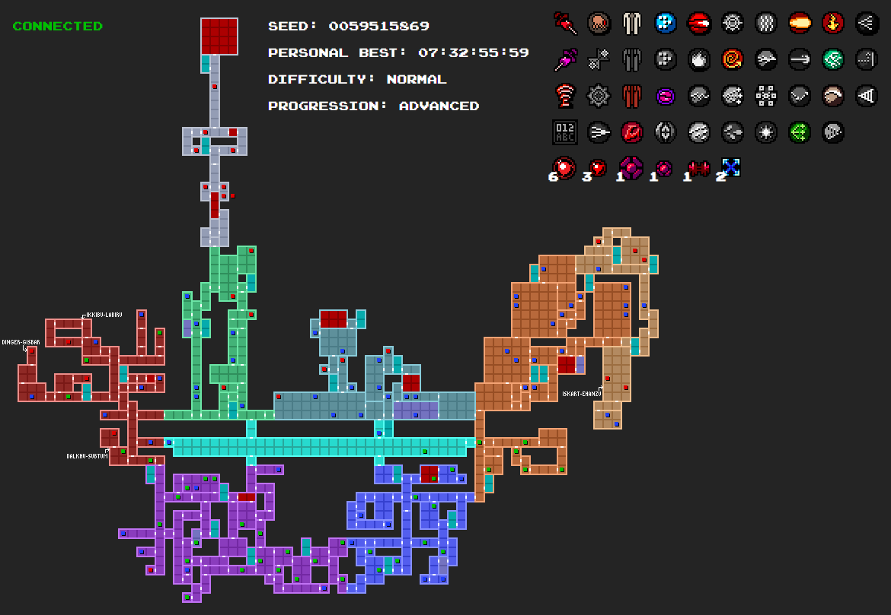

# Axiom Verge Randomizer Tracker
Map and item tracker for Axiom Verge's randomizer mode. It uses an SDK built into Axiom Verge to get tracker data and display it in your browser.

[Real Time Tracker SDK Documentation](https://axiom-verge-tracker-documentation.readthedocs.io/en/latest/)

### Features
- Stat display for seed, personal best, difficulty and progression mode
- Item tracker showing collected items and upgrades
- World map that displays item locations and whether the player can acquire the item with current equipment
- Clicking a map marker displays the equipment combinations required to acquire the item relevant for the current progression mode

## How to use
1. Start Axiom Verge
2. Go to Randomizer mode options and set "Web Tracker" to "On"
3. Open `tracker.html` in your browser
4. Start the existing or new game in randomizer mode

NOTE: Some information is not updated instantly, so some data may be out of sync. This is a limitation on how Axiom Verge sends the tracker data. Usually collecting and item or entering a different area will cause an update. If you open the tracker before Axiom Verge, you will need to refresh the page afterward.

## Map markers

 Unavailable Item 
 Available Item 
 Collected Item
